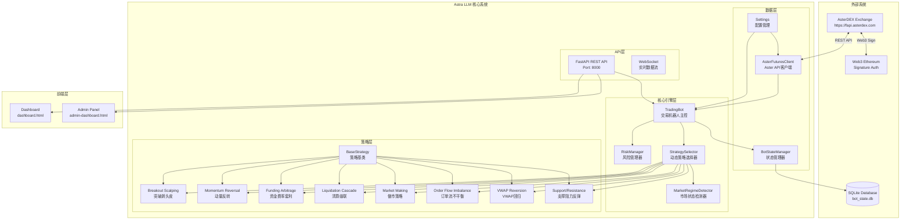
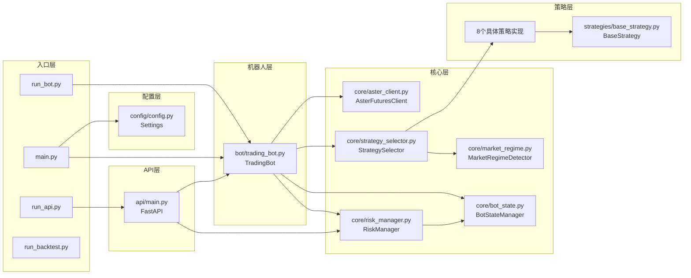
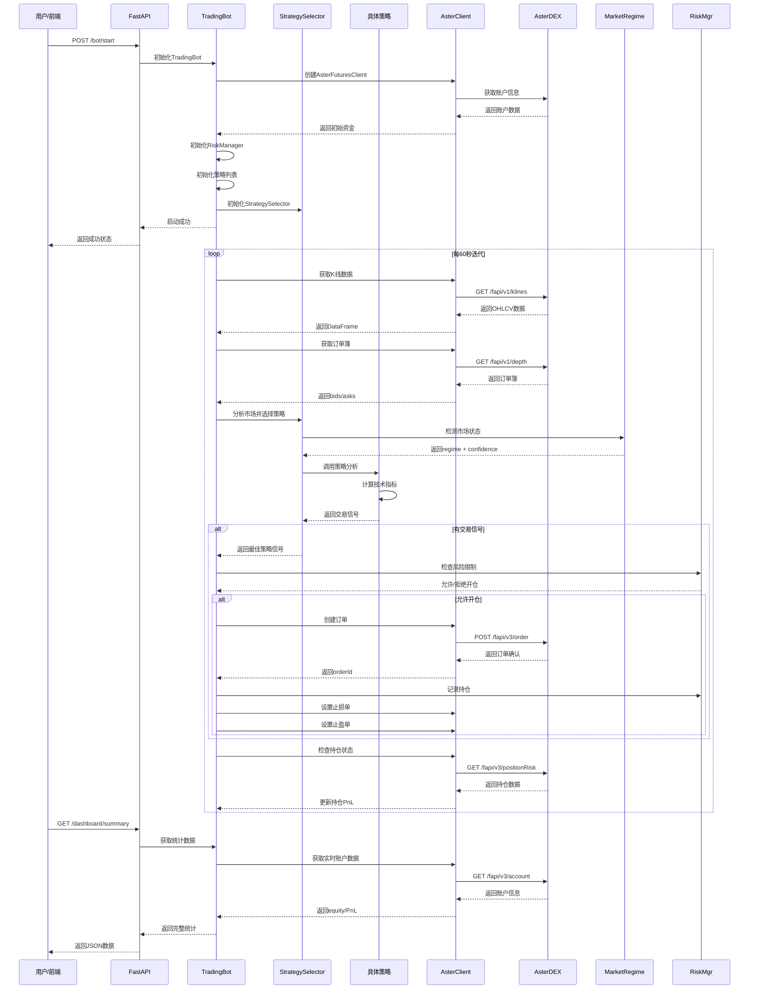
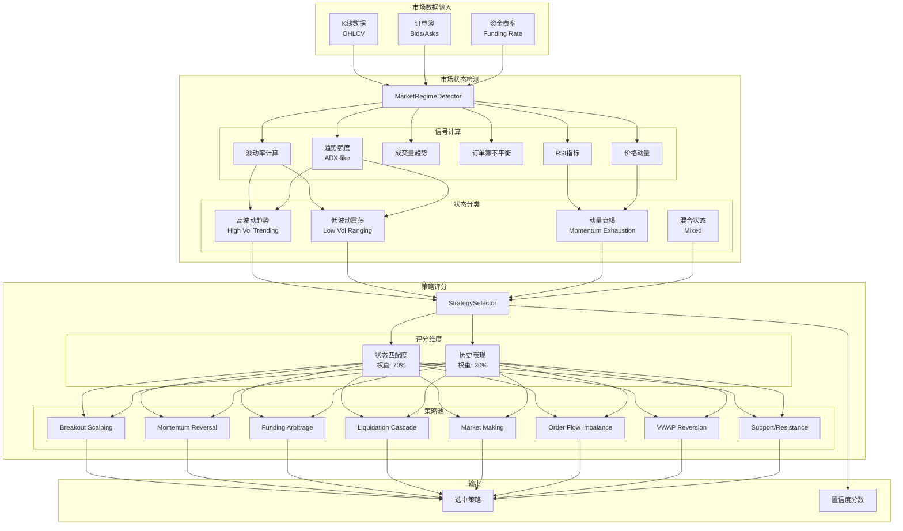
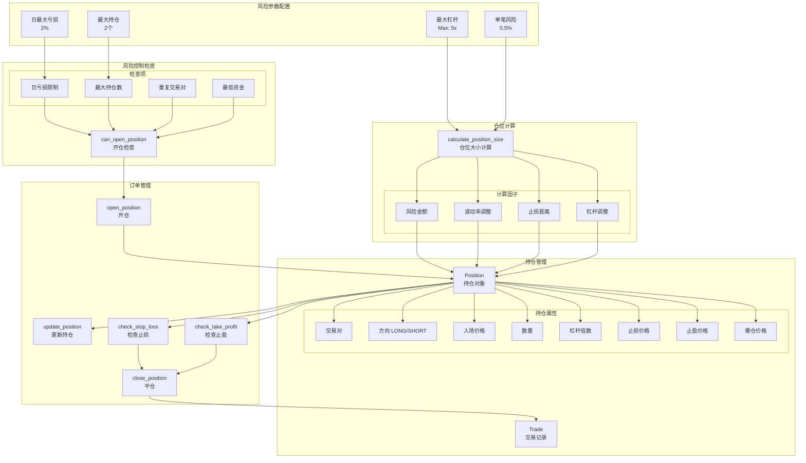
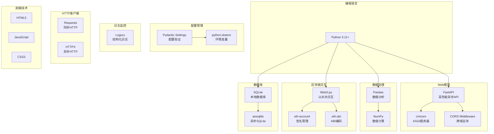

# Astra LLM 项目架构图

## 1. 系统整体架构

```mermaid
graph TB
    subgraph 外部系统
        AsterDEX[AsterDEX Exchange<br/>https://fapi.asterdex.com]
        Web3[Web3 Ethereum<br/>Signature Auth]
        Database[(SQLite Database<br/>bot_state.db)]
    end

    subgraph Astra LLM 核心系统
        subgraph API层
            FastAPI[FastAPI REST API<br/>Port: 8000]
            WebSocket[WebSocket<br/>实时数据流]
        end

        subgraph 核心引擎层
            TradingBot[TradingBot<br/>交易机器人主控]
            RiskManager[RiskManager<br/>风险管理器]
            StrategySelector[StrategySelector<br/>动态策略选择器]
            MarketRegime[MarketRegimeDetector<br/>市场状态检测器]
        end

        subgraph 策略层
            BaseStrategy[BaseStrategy<br/>策略基类]
            Breakout[Breakout Scalping<br/>突破剥头皮]
            Momentum[Momentum Reversal<br/>动量反转]
            Funding[Funding Arbitrage<br/>资金费率套利]
            Liquidation[Liquidation Cascade<br/>清算级联]
            MarketMaking[Market Making<br/>做市策略]
            OrderFlow[Order Flow Imbalance<br/>订单流不平衡]
            VWAP[VWAP Reversion<br/>VWAP回归]
            SupportResist[Support/Resistance<br/>支撑阻力反弹]
        end

        subgraph 数据层
            AsterClient[AsterFuturesClient<br/>Aster API客户端]
            BotState[BotStateManager<br/>状态管理器]
            Config[Settings<br/>配置管理]
        end
    end

    subgraph 前端层
        Dashboard[Dashboard<br/>dashboard.html]
        AdminPanel[Admin Panel<br/>admin-dashboard.html]
    end

    %% 数据流连接
    AsterDEX <-->|REST API| AsterClient
    AsterDEX <-->|Web3 Sign| Web3
    AsterClient --> TradingBot
    TradingBot --> RiskManager
    TradingBot --> StrategySelector
    StrategySelector --> MarketRegime
    
    BaseStrategy --> Breakout
    BaseStrategy --> Momentum
    BaseStrategy --> Funding
    BaseStrategy --> Liquidation
    BaseStrategy --> MarketMaking
    BaseStrategy --> OrderFlow
    BaseStrategy --> VWAP
    BaseStrategy --> SupportResist
    
    StrategySelector --> Breakout
    StrategySelector --> Momentum
    StrategySelector --> Funding
    StrategySelector --> Liquidation
    StrategySelector --> MarketMaking
    StrategySelector --> OrderFlow
    StrategySelector --> VWAP
    StrategySelector --> SupportResist
    
    TradingBot --> BotState
    BotState --> Database
    
    FastAPI --> TradingBot
    FastAPI --> Dashboard
    FastAPI --> AdminPanel
    
    Config --> TradingBot
    Config --> AsterClient
```

## 2. 模块依赖关系图

```mermaid
graph LR
    subgraph 入口层
        Main[main.py]
        RunBot[run_bot.py]
        RunAPI[run_api.py]
        RunBacktest[run_backtest.py]
    end

    subgraph 配置层
        Config[config/config.py<br/>Settings]
    end

    subgraph 机器人层
        Bot[bot/trading_bot.py<br/>TradingBot]
    end

    subgraph 核心层
        AsterClient[core/aster_client.py<br/>AsterFuturesClient]
        RiskMgr[core/risk_manager.py<br/>RiskManager]
        StrategySel[core/strategy_selector.py<br/>StrategySelector]
        MarketReg[core/market_regime.py<br/>MarketRegimeDetector]
        BotStateMgr[core/bot_state.py<br/>BotStateManager]
    end

    subgraph 策略层
        BaseStrat[strategies/base_strategy.py<br/>BaseStrategy]
        AllStrats[8个具体策略实现]
    end

    subgraph API层
        API[api/main.py<br/>FastAPI]
    end

    Main --> Config
    RunBot --> Bot
    RunAPI --> API
    
    Main --> Bot
    Bot --> AsterClient
    Bot --> RiskMgr
    Bot --> StrategySel
    Bot --> BotStateMgr
    
    StrategySel --> MarketReg
    StrategySel --> AllStrats
    
    RiskMgr --> BotStateMgr
    
    AllStrats --> BaseStrat
    
    API --> Bot
    API --> RiskMgr
```

## 3. 数据流架构

```mermaid
sequenceDiagram
    participant User as 用户/前端
    participant API as FastAPI
    participant Bot as TradingBot
    participant Selector as StrategySelector
    participant Strategy as 具体策略
    participant Aster as AsterClient
    participant Exchange as AsterDEX

    %% 启动流程
    User->>API: POST /bot/start
    API->>Bot: 初始化TradingBot
    Bot->>Aster: 创建AsterFuturesClient
    Aster->>Exchange: 获取账户信息
    Exchange-->>Aster: 返回账户数据
    Aster-->>Bot: 返回初始资金
    Bot->>Bot: 初始化RiskManager
    Bot->>Bot: 初始化策略列表
    Bot->>Selector: 初始化StrategySelector
    Bot-->>API: 启动成功
    API-->>User: 返回成功状态

    %% 交易循环
    loop 每60秒迭代
        Bot->>Aster: 获取K线数据
        Aster->>Exchange: GET /fapi/v1/klines
        Exchange-->>Aster: 返回OHLCV数据
        Aster-->>Bot: 返回DataFrame
        
        Bot->>Aster: 获取订单簿
        Aster->>Exchange: GET /fapi/v1/depth
        Exchange-->>Aster: 返回订单簿
        Aster-->>Bot: 返回bids/asks
        
        Bot->>Selector: 分析市场并选择策略
        Selector->>MarketRegime: 检测市场状态
        MarketRegime-->>Selector: 返回regime + confidence
        
        Selector->>Strategy: 调用策略分析
        Strategy->>Strategy: 计算技术指标
        Strategy-->>Selector: 返回交易信号
        
        alt 有交易信号
            Selector-->>Bot: 返回最佳策略信号
            Bot->>RiskMgr: 检查风险限制
            RiskMgr-->>Bot: 允许/拒绝开仓
            
            alt 允许开仓
                Bot->>Aster: 创建订单
                Aster->>Exchange: POST /fapi/v3/order
                Exchange-->>Aster: 返回订单确认
                Aster-->>Bot: 返回orderId
                Bot->>RiskMgr: 记录持仓
                Bot->>Aster: 设置止损单
                Bot->>Aster: 设置止盈单
            end
        end
        
        Bot->>Aster: 检查持仓状态
        Aster->>Exchange: GET /fapi/v3/positionRisk
        Exchange-->>Aster: 返回持仓数据
        Aster-->>Bot: 更新持仓PnL
    end

    %% 查询流程
    User->>API: GET /dashboard/summary
    API->>Bot: 获取统计数据
    Bot->>Aster: 获取实时账户数据
    Aster->>Exchange: GET /fapi/v3/account
    Exchange-->>Aster: 返回账户信息
    Aster-->>Bot: 返回equity/PnL
    Bot-->>API: 返回完整统计
    API-->>User: 返回JSON数据
```

## 4. 策略选择架构

```mermaid
graph TB
    subgraph 市场数据输入
        KLines[K线数据<br/>OHLCV]
        OrderBook[订单簿<br/>Bids/Asks]
        Funding[资金费率<br/>Funding Rate]
    end

    subgraph 市场状态检测
        MR[MarketRegimeDetector]
        
        subgraph 信号计算
            Vol[波动率计算]
            Trend[趋势强度<br/>ADX-like]
            Volume[成交量趋势]
            OB[订单簿不平衡]
            RSI[RSI指标]
            Momentum[价格动量]
        end
        
        subgraph 状态分类
            HighVol[高波动趋势<br/>High Vol Trending]
            LowVol[低波动震荡<br/>Low Vol Ranging]
            MomExhaust[动量衰竭<br/>Momentum Exhaustion]
            Mixed[混合状态<br/>Mixed]
        end
    end

    subgraph 策略评分
        SS[StrategySelector]
        
        subgraph 评分维度
            RegimeMatch[状态匹配度<br/>权重: 70%]
            Performance[历史表现<br/>权重: 30%]
        end
        
        subgraph 策略池
            S1[Breakout Scalping]
            S2[Momentum Reversal]
            S3[Funding Arbitrage]
            S4[Liquidation Cascade]
            S5[Market Making]
            S6[Order Flow Imbalance]
            S7[VWAP Reversion]
            S8[Support/Resistance]
        end
    end

    subgraph 输出
        Selected[选中策略]
        Confidence[置信度分数]
    end

    KLines --> MR
    OrderBook --> MR
    Funding --> MR
    
    MR --> Vol
    MR --> Trend
    MR --> Volume
    MR --> OB
    MR --> RSI
    MR --> Momentum
    
    Vol --> HighVol
    Vol --> LowVol
    Trend --> HighVol
    Trend --> LowVol
    RSI --> MomExhaust
    Momentum --> MomExhaust
    
    HighVol --> SS
    LowVol --> SS
    MomExhaust --> SS
    Mixed --> SS
    
    SS --> RegimeMatch
    SS --> Performance
    
    RegimeMatch --> S1
    RegimeMatch --> S2
    RegimeMatch --> S3
    RegimeMatch --> S4
    RegimeMatch --> S5
    RegimeMatch --> S6
    RegimeMatch --> S7
    RegimeMatch --> S8
    
    Performance --> S1
    Performance --> S2
    Performance --> S3
    Performance --> S4
    Performance --> S5
    Performance --> S6
    Performance --> S7
    Performance --> S8
    
    S1 --> Selected
    S2 --> Selected
    S3 --> Selected
    S4 --> Selected
    S5 --> Selected
    S6 --> Selected
    S7 --> Selected
    S8 --> Selected
    
    SS --> Confidence
```

## 5. 风险管理架构

```mermaid
graph TB
    subgraph 风险参数配置
        MaxLeverage[最大杠杆<br/>Max: 5x]
        RiskPerTrade[单笔风险<br/>0.5%]
        MaxDailyLoss[日最大亏损<br/>2%]
        MaxPositions[最大持仓<br/>2个]
    end

    subgraph 持仓管理
        Position[Position<br/>持仓对象]
        Trade[Trade<br/>交易记录]
        
        subgraph 持仓属性
            Symbol[交易对]
            Side[方向 LONG/SHORT]
            EntryPrice[入场价格]
            Quantity[数量]
            Leverage[杠杆倍数]
            SL[止损价格]
            TP[止盈价格]
            LiqPrice[爆仓价格]
        end
    end

    subgraph 风险控制检查
        CanOpen[can_open_position<br/>开仓检查]
        
        subgraph 检查项
            CheckDailyLoss[日亏损限制]
            CheckMaxPos[最大持仓数]
            CheckSymbol[重复交易对]
            CheckCapital[最低资金]
        end
    end

    subgraph 仓位计算
        CalcSize[calculate_position_size<br/>仓位大小计算]
        
        subgraph 计算因子
            RiskAmount[风险金额]
            Volatility[波动率调整]
            StopDistance[止损距离]
            LeverageAdj[杠杆调整]
        end
    end

    subgraph 订单管理
        OpenPos[open_position<br/>开仓]
        ClosePos[close_position<br/>平仓]
        UpdatePos[update_position<br/>更新持仓]
        CheckSL[check_stop_loss<br/>检查止损]
        CheckTP[check_take_profit<br/>检查止盈]
    end

    MaxLeverage --> CalcSize
    RiskPerTrade --> CalcSize
    
    CalcSize --> RiskAmount
    CalcSize --> Volatility
    CalcSize --> StopDistance
    CalcSize --> LeverageAdj
    
    RiskAmount --> Position
    Volatility --> Position
    StopDistance --> Position
    LeverageAdj --> Position
    
    Position --> Symbol
    Position --> Side
    Position --> EntryPrice
    Position --> Quantity
    Position --> Leverage
    Position --> SL
    Position --> TP
    Position --> LiqPrice
    
    MaxDailyLoss --> CheckDailyLoss
    MaxPositions --> CheckMaxPos
    
    CheckDailyLoss --> CanOpen
    CheckMaxPos --> CanOpen
    CheckSymbol --> CanOpen
    CheckCapital --> CanOpen
    
    CanOpen --> OpenPos
    OpenPos --> Position
    
    Position --> UpdatePos
    Position --> CheckSL
    Position --> CheckTP
    
    CheckSL --> ClosePos
    CheckTP --> ClosePos
    
    ClosePos --> Trade
```

## 6. 技术栈架构

```mermaid
graph TB
    subgraph 编程语言
        Python[Python 3.11+]
    end

    subgraph Web框架
        FastAPI[FastAPI<br/>高性能异步API]
        Uvicorn[Uvicorn<br/>ASGI服务器]
        CORS[CORS Middleware<br/>跨域支持]
    end

    subgraph 数据处理
        Pandas[Pandas<br/>数据分析]
        NumPy[NumPy<br/>数值计算]
    end

    subgraph 区块链交互
        Web3[Web3.py<br/>以太坊交互]
        EthAccount[eth-account<br/>签名管理]
        EthABI[eth-abi<br/>ABI编码]
    end

    subgraph 数据库
        SQLite[SQLite<br/>本地数据库]
        Aiosqlite[aiosqlite<br/>异步SQLite]
    end

    subgraph 配置管理
        Pydantic[Pydantic Settings<br/>配置验证]
        PythonDotenv[python-dotenv<br/>环境变量]
    end

    subgraph 日志监控
        Loguru[Loguru<br/>结构化日志]
    end

    subgraph HTTP客户端
        Requests[Requests<br/>同步HTTP]
        HTTPX[HTTPX<br/>异步HTTP]
    end

    subgraph 前端技术
        HTML5[HTML5]
        JavaScript[JavaScript]
        CSS3[CSS3]
    end

    Python --> FastAPI
    Python --> Pandas
    Python --> Web3
    Python --> SQLite
    
    FastAPI --> Uvicorn
    FastAPI --> CORS
    
    Pandas --> NumPy
    
    Web3 --> EthAccount
    Web3 --> EthABI
    
    SQLite --> Aiosqlite
    
    Pydantic --> PythonDotenv
```
